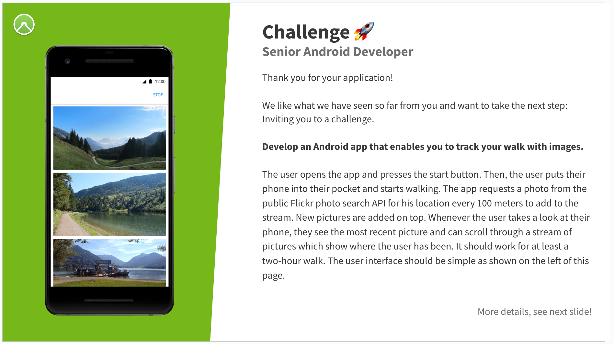

# komoot Senior Android Developer challenge

## Challenge

> **Develop an Android app that enables you to track your walk with images.**

> The user opens the app and presses the start button. Then, the user puts their phone into their
> pocket and starts walking. The app requests a photo from the public Flickr photo search API for
> his location every 100 meters to add to the stream. New pictures are added on top. Whenever the
> user takes a look at their phone, they see the most recent picture and can scroll through a stream
> of pictures which show where the user has been. It should work for at least a two-hour walk.
> The user interface should be simple as shown on the left of this page.

## Work log

The work log describes my thought process and how I tackled the challenge. Below it also gives a
rough overview of the architecture and why I choose it.

### Task breakdown

The first I did is to break down the task into smaller chunks and identify the unknowns.

- Get location updates while the app is in the background and the screen is turned off
- Trigger an action when the user has moved 100 meters
- Get a photo from Flickr for a location
- Display the photo in the app

These chunks are more or less also the order of unknowns. Therefor I tackled them in order one by
one while keeping the other requirements in mind.

### "Get location updates while the app is in the background and the screen is turned off"

I knew that it is a problem to get location updates while the screen is turned off because of power
saving concerns.

Because of the 100m trigger requirement I was also thinking about geo fences and it might be a need
trick to use them instead of location updates. Create a circular geo fence with 100m radius and as
soon as the user leaves the fence trigger the action.
Also I was thinking that geo fences might have no/less background restrictions because they are
managed by the system.

So I started to read the official docs about location updates and geo fences:

- [Request location updates][locUpdates]
- [Access location in the background][backUpdates]
- [Background Location Limits][backLimits]

[locUpdates]: https://developer.android.com/develop/sensors-and-location/location/request-updates

[backUpdates]: https://developer.android.com/develop/sensors-and-location/location/background

[backLimits]: https://developer.android.com/about/versions/oreo/background-location-limits

#### Findings

- Location updates are severely restricted in the background. Only a few updates per hour are
  allowed.
- Geo fences are less restricted then Fused Location Provider but still not frequent enough
  > Background apps can receive geofencing transition events more frequently than updates from the
  Fused Location Provider. The average responsiveness for a geofencing event is every couple of
  minutes or so.
- Apps in foreground incl. foreground services are not restricted in location updates.
  > If your app is running in the foreground, there is no change in location sampling rates compared
  to Android 7.1.1 (API level 25).
    - Funny thing is you don't even necessarily need to ask for notification permission for the
      foreground service. I did it nonetheless because I wanted to have a visual indicator that the
      service is running.

#### Implementation

To verify this I implemented a quick foreground service that requests location updates and loges
them to the console. After this seemed to work without problems I extracted the location request
logic into a separate class (separation of concerns, etc). Because I knew that I will be doing quite
a bit of dependency injection I also set up koin as a dependency injection framework. I like it
because it doesn't need a lot of setup.

### "Trigger an action when the user has moved 100 meters"

I knew beforehand that it is trivial to calculate the distance between two locations but for this I
needed to save the last location I started the 100m measurement from. I also needed to provide the
location somehow to the UI. I decided to store everything in a database. The foreground service can
still access the last location the measurement was started from and the UI can subscribe on the
dataset and get notified about changes like a new location.

I used sqldelight for interacting with the database. I like that it doesn't totally abstract away
the SQL like Room does. Also I started to use it for a Kotlin multiplatform project I am working on.

### Interlude: Architecture

#### Business logic / Services

I decided to use a "service" architecture. I put the "business logic" into so called services. They
encapsulate functionality and are responsible for one thing only (see services package). Because of
this they are easy to test and don't have a lot of overhead like for example clean architecture.
They can be injected into each other. This is a benefit and a drawback. It keeps it simple at the
start of a project to use these services in multiple places but can lead to a lot of dependencies
that need to be mocked for testing.

- **Notification service**: Sets up notification channels and provides notifications
- **Location client**: Provides a convenient interface to subscribe to location updates
- **Flickr service**: Fetches photos from Flickr for a location, picks a random one and constructs
  the photo url
- **Waypoint service**: Checks for each new location if the user has moved 100m and if so fetches a
  photo for the location and saves it as a to the database. It also provides the list of all
  waypoints.

#### LocationTrackingForegroundService

As already mentioned above I created a foreground service that subscribes to location updates. For
each new location it triggers WaypointService to check if the new location is a waypoint. When the
service stops the database is cleared and the location updates are canceled.

#### MainViewModel

The MainViewModel subscribes to the waypoint updates and provides them to the UI. For this a state
is used that also decides what functionality is available.

#### MainActivity

The MainActivity checks if all required permissions are granted and if so kicks off the VM to start
the waypoint updates. I keep everything quite simple here.

### "Get a photo from Flickr for a location" and "Display the photo in the app"

Interacting with the Flicker API and displaying pictures from remote was never a big concern to me
so I postponed this task till the end. The biggest problem I had was to understand the Flickr API
documentation. The information is a bit spread out and convoluted. RTFM I guess ^^

As rest client I used ktor because I recently started to use it for Kotlin multiplatform projects.
Retrofit I used already a lot so this was another opportunity to learn more about ktor. I actually
didn't learn anything new but you never know.

As image loading library I used coil just because I wanted to use it more.

## Improvements

- Location logging
    - It might be more accurate to log all the locations
    - For example if a walk goes up a mountain in serpentine
    - There might not be a 100m distance between waypoints from the bird eye view but the user still
      has walked more then 100m

- The UI is not that responsive to foreground service state
    - The activity starts the foreground service and subscribes to the waypoint updates
    - The time between the service starts and the first waypoint update can be quite long
    - The UI uses the waypoint updates to indicate if a service is running
    - If the service actually gets killed without clearing the database the UI will still show that
      the service is running

- The service is responsible for fetching the picture but this could also be done only when the UI
  needs it

- Handling the case that no picture is available for a location

- Handling the case that the user has no internet connection

- Handling the case that there are just a few pictures available for a location and make sure that
  the user doesn't see the same pictures over and over again

- There is no possibility to view the waypoints after the service has stopped

- Adding new waypoints at the top is not handled very smooth

- Testing